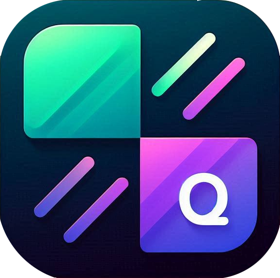

<div style="text-align: center;">

[](https://gitlab.com/flxholle/quick-tiles/-/releases)
[](https://gitlab.com/flxholle/quick-tiles/-/graphs/master)
[](https://gitlab.com/flxholle/quick-tiles/-/forks)
[](https://gitlab.com/flxholle/quick-tiles/-/starrers)
[](https://gitlab.com/flxholle/quick-tiles/-/issues)
[](https://gitlab.com/flxholle/quick-tiles/-/blob/master/LICENSE.txt)

[#top]

</div>


<br />
<div align="center">


<h3 align="center">QuickTiles</h3>

<p align="center">
    Add custom quick settings tiles to your Android device.
    <br />
    <a href="#about-the-project">View Project</a>
    &middot;
    <a href="https://gitlab.com/flxholle/quick-tiles/-/issues/new?issue%5Bissue_type%5D=issue">Report Bug</a>
    &middot;
    <a href="https://gitlab.com/flxholle/quick-tiles/-/issues/new?issue%5Bissue_type%5D=enhancement">Request Feature</a>
  </p>

</div>

<details>
  <summary>Table of Contents</summary>
  <ol>
    <li><a href="#about-the-project">About The Project</a>
      <ul>
        <li><a href="#features">Features</a></li>
        <li><a href="#built-with">Built With</a></li>
      </ul>
    </li>
    <li><a href="#usage">Usage</a></li>
    <li><a href="#google-play-protect-warning">Google Play Protect Warning</a></li>
    <li><a href="#contributing">Contributing</a>
      <ul>
        <li><a href="#prerequisites">Prerequisites</a></li>
        <li><a href="#installation">Installation</a></li>
        <li><a href="#how-to-contribute">How to Contribute</a></li>
      </ul>
    </li>
    <li><a href="#roadmap">Roadmap</a></li>
    <li><a href="#license">License</a></li>
    <li><a href="#contact">Contact</a></li>
    <li><a href="#acknowledgments">Acknowledgments</a></li>
  </ol>
</details>

## About The Project
QuickTiles lets you add custom quick settings tiles to your Android device, enabling fast access to
your favorite actions and shortcuts. The app is open source and privacy-friendly.


### Download

[](https://f-droid.org/packages/com.asdoi.quicktiles/)


<div align="right">(<a href="#top">back to top</a>)</div>

### Features ✨

- 🎵 Media control (play/pause, next, previous, media volume)
- 🔊 Show volume panel
- 📅 New event/alarm/timer
- 📞 Make call
- 📷 Take photo/record video
- 🧮 Open calculator/file manager
- 📱 Open custom apps
- 🔍 Search settings
- 🌐 Open languages
- 📖 Open dictionary/privacy
- 🔗 Open VPN/data usage/screen cast/connected devices/about
- ⏲️ Set screen timeout
- 🔔 Switch volume modes (normal, vibrate, priority only, alarms only, total silence)
- 💡 Adjust brightness
- 🌙 Adaptive brightness toggle
- 🌑 Grayscale
- 📸 Take screenshot
- 🔄 Force rotation (0°, 90°, 180°, 270°)
- 🔒 Lock screen
- 🖥️ Split screen
- 📳 Set vibration on calls
- ⚡ Open power menu
- 🔋 Show battery level
- 🔢 Counter
- 🐞 Enable/disable USB debugging
- 🕹️ Enable/Disable demo mode
- 🛠️ Open developer options
- 🌙 Enable/Disable keep screen on
- 🏃 Set animator duration scale
- 🚫 Disable all animations
- 🏁 Always finish activities

<div align="right">(<a href="#top">back to top</a>)</div>

### Built With

* 
* 
* 
* 

<div align="right">(<a href="#top">back to top</a>)</div>

## Usage

After installing, open QuickTiles and enable the tiles you want to use. You can then access them
from the quick settings panel on your Android device.

<div align="right">(<a href="#top">back to top</a>)</div>

## Google Play Protect Warning

**Important:**
Google Play Protect may warn that QuickTiles is a "harmful app."
This is a false positive. You can check the full source code in this repository — there is no
malicious activity.

If you disable Play Protect, Android may still periodically show warnings. This seems to be because
Android stores previously detected warnings and repeats them, even after Play Protect is turned off.

<div align="right">(<a href="#top">back to top</a>)</div>

## Contributing

Contributions make open source amazing. If you have an idea or fix, please:

### Prerequisites

- Android Studio
- Android device or emulator

### Installation

1. Clone the repo

```sh
   git clone https://gitlab.com/flxholle/quick-tiles.git
```

2. Open the project in Android Studio.
3. Build and run the app on your device.

### How to Contribute

1. Fork the Project
2. Create a new branch (`git checkout -b feature/AmazingFeature`)
3. Commit changes (`git commit -m 'Add some AmazingFeature'`)
4. Push to the branch (`git push origin feature/AmazingFeature`)
5. Open a Pull Request

<div align="right">(<a href="#top">back to top</a>)</div>

## Roadmap

- Add customizations to "Demo Mode"
  from [Dev-QuickSettings (feature/settings)](https://github.com/adriangl/Dev-QuickSettings/tree/feature/settings)
- Add JobServices to check if the system settings were manually changed by the user
- Fix the delay after a tile is pressed

## License

Distributed under the GPLv3 License. See `LICENSE` for details.

<div align="right">(<a href="#top">back to top</a>)</div>

## Contact

Felix Hollederer - [@flxholle](https://gitlab.com/flxholle) - flxholle@posteo.com

Project
Link: [https://gitlab.com/flxholle/quick-tiles](https://gitlab.com/flxholle/quick-tiles)

<div align="right">(<a href="#top">back to top</a>)</div>

## Acknowledgments

### Icons

- Old App icon by [Freepik](https://www.flaticon.com/authors/freepik)
  from [Flaticon](https://www.flaticon.com/)
- New App Icon generated with DALL-E 3
  ([OpenAI](https://openai.com/dall-e-3/))
- Toggle-split-screen icon by [Smashicons](https://www.flaticon.com/authors/smashicons)
  from [Flaticon](https://www.flaticon.com/)

### Open Source Projects

- [Dev-Tiles](https://github.com/mustafa01ali/Dev-Tiles) by Mustafa
  Ali ([Apache License 2.0](https://www.apache.org/licenses/LICENSE-2.0.txt))
- [Dev-QuickSettings](https://github.com/adriangl/Dev-QuickSettings) by Adrián
  García ([Apache License 2.0](https://www.apache.org/licenses/LICENSE-2.0.txt))
- [Adaptive Brightness Tile](https://github.com/rascarlo/AdaptiveBrightnessTile) by
  rascarlo ([GNU GPLv3](https://www.gnu.org/licenses/gpl-3.0.txt))
- [PowerButtonTile](https://github.com/rascarlo/PowerButtonTile) by
  rascarlo ([GNU GPLv3](https://www.gnu.org/licenses/gpl-3.0.txt))
- [Greyscale](https://github.com/fei-ke/Greyscale) by
  fei-ke ([Apache License 2.0](https://www.apache.org/licenses/LICENSE-2.0.txt))

<div align="right">(<a href="#top">back to top</a>)</div>


[contributors-shield]: https://img.shields.io/gitlab/contributors/flxholle/quick-tiles?style=for-the-badge

[contributors-url]: https://gitlab.com/flxholle/quick-tiles/-/graphs/master

[forks-shield]: https://img.shields.io/gitlab/forks/flxholle/quick-tiles?style=for-the-badge

[forks-url]: https://gitlab.com/flxholle/quick-tiles/-/forks

[stars-shield]: https://img.shields.io/gitlab/stars/flxholle/quick-tiles?style=for-the-badge

[stars-url]: https://gitlab.com/flxholle/quick-tiles/-/starrers

[issues-shield]: https://img.shields.io/gitlab/issues/flxholle/quick-tiles?style=for-the-badge

[issues-url]: https://gitlab.com/flxholle/quick-tiles/-/issues

[license-shield]: https://img.shields.io/badge/license-Unlicense-blue.svg?style=for-the-badge

[license-url]: https://gitlab.com/flxholle/quick-tiles/-/blob/master/LICENSE.txt